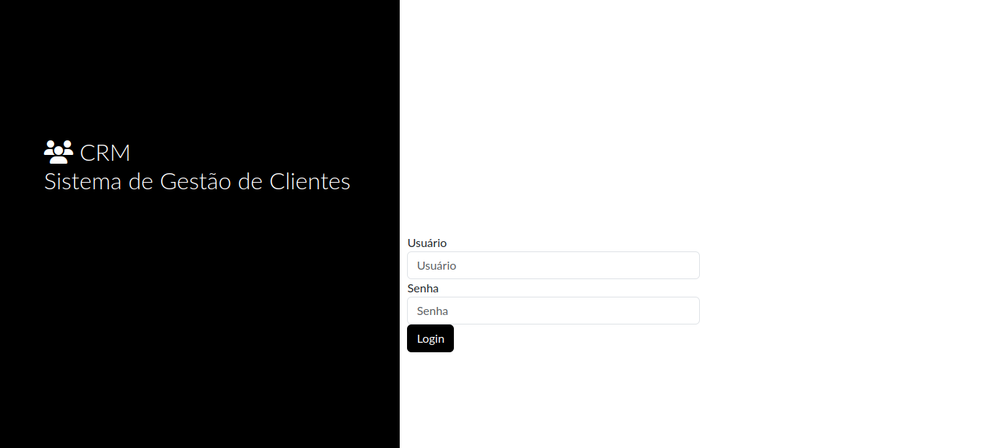
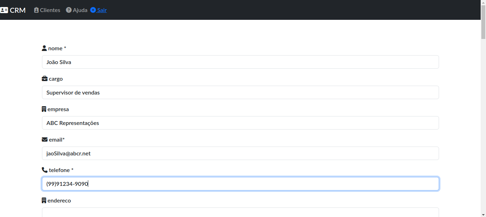
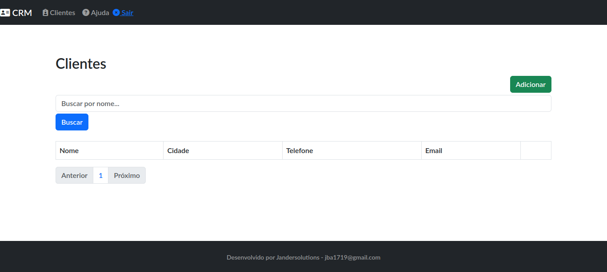

# Sistema de Gestão de Clientes **DJANGO CRM**
## Descrição

📊 O Sistema de Gestão de Clientes é uma aplicação web que permite a uma empresa acompanhar e gerenciar informações sobre seus clientes de forma eficiente. O projeto tem como objetivo facilitar a organização de dados, históricos, interações e informações relevantes sobre os clientes.

## Recursos e Funcionalidades

✅ Cadastro de Clientes: Cadastre informações básicas do cliente, como nome, cargo, empresa, e-mail, telefone, endereço e outros detalhes.

✅ Rastreamento de Relacionamento: Acompanhe o início do relacionamento com cada cliente, incluindo a data de início do relacionamento e o tipo de cliente.

✅ Status de Conta: Defina o status da conta do cliente, como ativo, inativo ou suspenso.

✅ Detalhes Adicionais: Mantenha registros de idade, gênero, localização geográfica e histórico de interações com o cliente.

✅ Histórico de Compras: Registre compras anteriores do cliente, incluindo produtos ou serviços adquiridos e datas.

✅ Fontes de Aquisição: Registre a fonte ou canal através do qual o cliente foi adquirido ou se envolveu com a empresa.

✅ Campanhas de Marketing: Acompanhe as campanhas de marketing às quais o cliente respondeu ou participou.

✅ Tarefas e Ações Pendentes: Gerencie tarefas específicas relacionadas a cada cliente, como follow-ups e reuniões agendadas.

✅ Interesses e Preferências: Mantenha registro dos interesses e preferências do cliente em relação aos produtos ou serviços.

✅ Histórico de Suporte: Registre problemas ou suporte fornecido ao cliente.

✅ Tags e Categorização: Categorize e segmente os clientes usando tags para facilitar a classificação.

✅ Perfis Sociais: Adicione links para os perfis sociais do cliente, como LinkedIn, Twitter, etc.

## Instalação e Uso

- Faça o download ou clone este repositório.
- Instale as dependências necessárias executando pip install -r requirements.txt.
- Configure as configurações do banco de dados no arquivo settings.py.
- Execute as migrações do banco de dados com o comando python manage.py migrate.
- Crie um superusuário com python manage.py createsuperuser.
- Inicie o servidor de desenvolvimento com python manage.py runserver.
- Acesse a aplicação no navegador em http://localhost:8000.
## Contribuições

🤝 Contribuições são bem-vindas! Sinta-se à vontade para abrir uma issue para relatar bugs ou sugerir melhorias. Se desejar contribuir com código, faça um fork deste repositório, crie um branch para a sua feature e envie um pull request.

## Licença

📝 Este projeto está licenciado sob a Licença MIT.

## Contato

📬 Entre em contato pelo e-mailjba1719@gmail.com para qualquer dúvida ou sugestão relacionada ao projeto.

## Capturas de Tela

📸 Tela de Inicio

📸 Tela de Cadastros do Cliente

📸 Tela de Visualização de Clientes

## Aviso

⚠️ Este projeto é apenas uma simulação e não está conectado a um sistema real de gestão de clientes. Qualquer semelhança com produtos reais é mera coincidência.
